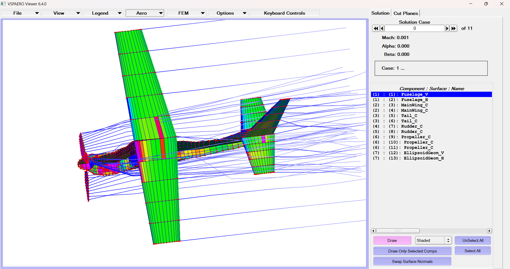

# Cessna 210 Airframe Reconstruction & VLM Analysis
**NASA Variant Parametric Modeling for HIL Testing**

  
   
  <i>Figure 1: Converged VSPAERO solution showing pressure coefficient ($C_p$) and wake streamlines.</i>

## Project Overview
This repository contains the 3D parametric reconstruction and aerodynamic verification of a Cessna 210 Centurion airframe. Developed in a 6-hour intensive sprint, this model serves as a "simulation-ready" digital twin for future hardware-in-the-loop (HIL) avionics integration.

## Technical Highlights
* **Geometric Fidelity:** Corrected a critical instructional typo that listed the vertical stabilizer height at 2.94 ft; verified and adjusted to ~7.10 ft based on NASA 3-view ratios to maintain aerodynamic stability.
* **Numerical Optimization:** Resolved initial Kutta condition failures ($N_k=0$) by implementing "Skew Both" trailing-edge closures, enabling the solver to identify 109 lifting nodes.
* **Computational Analysis:**
    * Performed an Alpha sweep ($0^\circ$ to $10^\circ$, $N_{pts}=11$) to characterize the lift-slope derivative.
    * Identified numerical asymmetry at wing-fuselage junctions as inherent VLM interference from non-lifting bodies.
    * Verified downwash effects via enabled wake streamlines, confirming lifting-line theory application.

## Repository Structure
- **/model**: Master `.vsp3` file and `.stp` CAD assembly.
- **/docs**: LaTeX source and [Technical Project Log (PDF)](docs/report/Cessna_210_Project_Log.pdf).
- **/media**: Converged pressure maps, drag polars, and geometric orthographics.

## How to View
1. Install [OpenVSP](https://openvsp.org/download.php).
2. Open `model/Cessna210.vsp3`.
3. To view simulation results, navigate to `Analysis -> VSPAERO -> Results Manager`.

---
*Developed by Aayushman Das, ETCE Dept., Jadavpur University (2026).*
